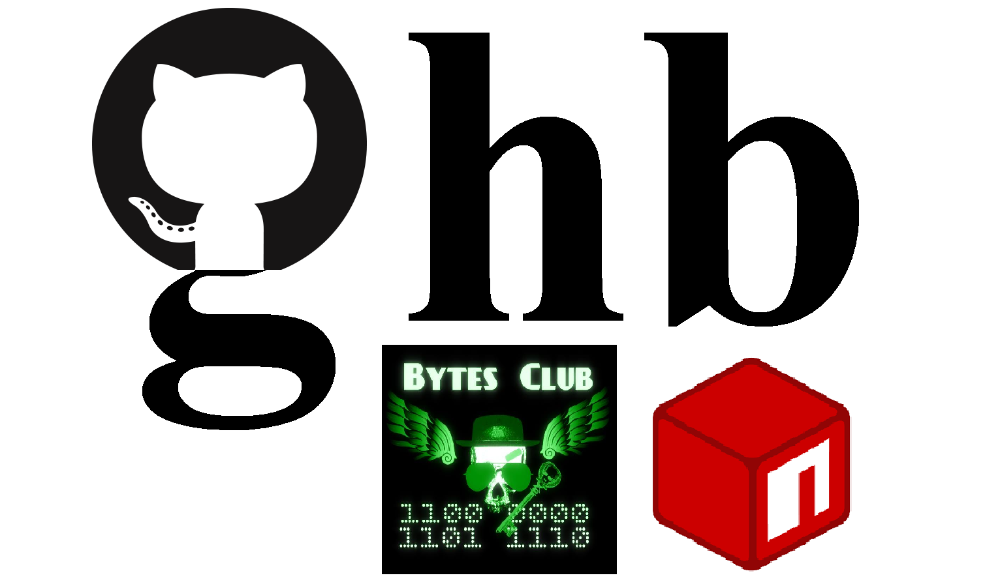
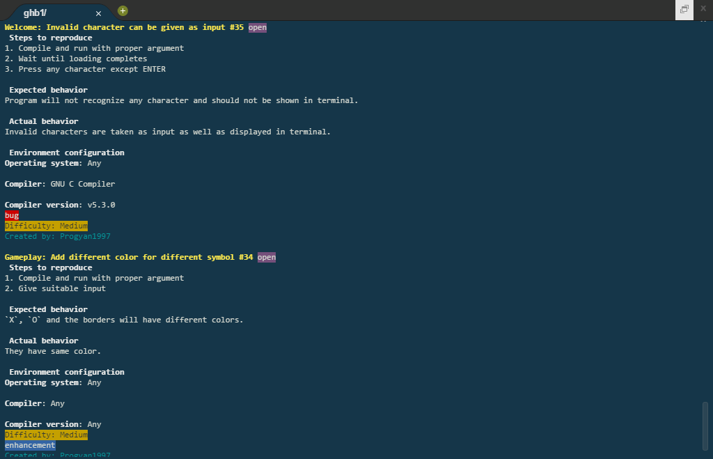

# ghb



ghb is a command line tool to fetch and update GitHub Issue and Pull Request from terminal

[](https://raw.githubusercontent.com/BytesClub/ghb/master/LICENSE)
[](https://travis-ci.org/BytesClub/ghb)
[](https://www.npmjs.com/package/ghb)
[](https://yarnpkg.com/en/package/ghb)
[](https://bower.io/search/?q=ghb)
[](https://github.com/BytesClub/ghb/issues)
[](mailto:bytes-club@googlegroups.com)
[](https://gitter.im/Bytes_Club/General)

### Installation

* Using _**npm**_
```bash
$ npm install ghb -g
```

* Using _**yarn**_
```bash
$ yarn global add ghb
```

* Using _**bower**(not recommended)_
```bash
$ bower install ghb
$ cd ./bower_component/ghb && npm link
```
&nbsp;&nbsp;&nbsp;&nbsp; _**Note:** Bower will install the package into local directory as dependency_

* Autocompletion Script
```bash
$ curl https://raw.githubusercontent.com/BytesClub/ghb/master/ghb-auto.sh > /etc/bash_completion.d/ghb
```
&nbsp;&nbsp;&nbsp;&nbsp; or
```bash
$ curl https://raw.githubusercontent.com/BytesClub/ghb/master/ghb-auto.sh >> ~/.bashrc && source ~/.bashrc
```

### Usage
* Configure _**ghb**_ with local repo
```bash
$ ghb init <github-url>
```
* Check status of _**ghb**_
```bash
$ ghb status
```
* Get latest issues/pr from GitHub
```bash
$ ghb issues [options: open | closed | all | id={ID} | label={LABELS}]
$ ghb pulls  [options: open | closed | all | id={ID} | label={LABELS}]
```

* Help option
```bash
$ ghb --help
$ ghb --version
```

### What's new _(v1.3.6)_
* The source code and binary files, and the data storage has been split in different directories.
* No longer need to re-setup _**ghb**_ in directories, in case of upgrading the package.

### What's new _(v1.3.4)_
* Added markdown support for Terminal
* Improved UI quality
* User can search open issues via label(s)
* Label color resembles that on GitHub


### Contribute
* If you find any bug or to request new feature register an issue.
* If you want to make design improvement [comment here](https://github.com/BytesClub/ghb/issues/10).
* Look issues and try to solve them and create a pull request

**IMPORTANT** Every commit must follow the standard:
```
shortlog: commit message

commit body

fixes: #<issue_number>

Signed-Off-By: [Your name] <your email>
```

#### [Bytes Club](https://bytesclub.github.io)
